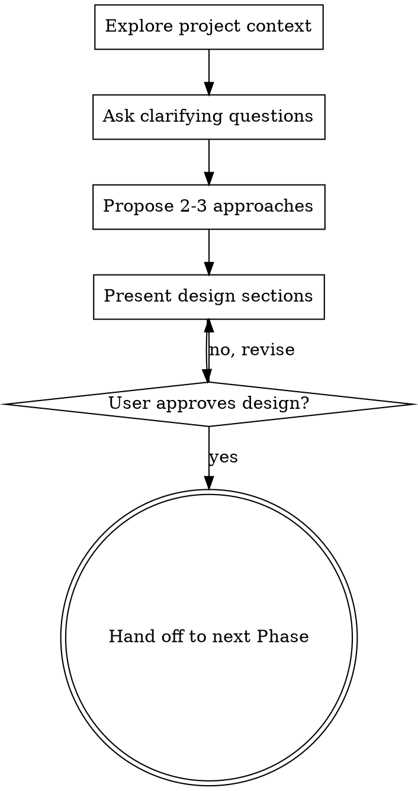

# Brainstorming Ideas Into Designs

## Overview

Help turn ideas into fully formed designs and specs through natural collaborative dialogue.

Start by understanding the current project context, then ask questions one at a time to refine the idea. Once you understand what you're building, present the design and get user approval.

<HARD-GATE>
Do NOT write any code or take any implementation action until you have presented a design and the user has approved it.
</HARD-GATE>

## Checklist

Complete these items in order:

1. **Explore project context** — check files, docs, recent commits
2. **Ask clarifying questions** — one at a time, understand purpose/constraints/success criteria
3. **Propose 2-3 approaches** — with trade-offs and your recommendation
4. **Present design** — in sections scaled to their complexity, get user approval after each section
5. **Hand off to next Phase** — brainstorming 결과를 CLAUDE.md 워크플로우의 다음 Phase로 전달

## Process Flow

## The Process

**Understanding the idea:**
- Check out the current project state first (files, docs, recent commits)
- Ask questions one at a time to refine the idea
- Prefer multiple choice questions when possible, but open-ended is fine too
- Only one question per message - if a topic needs more exploration, break it into multiple questions
- Focus on understanding: purpose, constraints, success criteria

**Exploring approaches:**
- Propose 2-3 different approaches with trade-offs
- Present options conversationally with your recommendation and reasoning
- Lead with your recommended option and explain why

**Presenting the design:**
- Once you believe you understand what you're building, present the design
- Scale each section to its complexity: a few sentences if straightforward, up to 200-300 words if nuanced
- Ask after each section whether it looks right so far
- Cover: architecture, components, data flow, error handling, testing
- Be ready to go back and clarify if something doesn't make sense

## After the Design

설계 승인 후, 다음 Phase로 진행:

| 호출 상황 | 전환 대상 |
|----------|----------|
| P0 파이프라인 진행 중 (planning-agent 경유) | planning-agent에게 설계 요약을 반환 → P0-B(Research) 진행 |
| 단독 호출 — 신규 기능 (Large) | P1(프롬프트 강화) → P2(PRD) → P3(개발 문서) 흐름 진행 |
| 단독 호출 — 신규 기능 (Medium) | P1(프롬프트 강화) → P4(구현) 흐름 진행 |
| 단독 호출 — 기존 기능 확장 | 개발 문서 생성(P3)으로 전환 |

설계 결과는 해당 Phase에서 `dev/active/` 문서에 반영됩니다.

### P0 파이프라인 연결 시 산출물

planning-agent 경유 시, 설계 결과를 **구조화된 요약**으로 반환:
- 선택된 접근 방식 (1줄 요약)
- 핵심 설계 결정 사항 (3~5개 bullet)
- 제약 조건 및 가정
- 추가 리서치가 필요한 영역 (있는 경우)

## Key Principles

- **One question at a time** - Don't overwhelm with multiple questions
- **Multiple choice preferred** - Easier to answer than open-ended when possible
- **YAGNI ruthlessly** - Remove unnecessary features from all designs
- **Explore alternatives** - Always propose 2-3 approaches before settling
- **Incremental validation** - Present design, get approval before moving on
- **Be flexible** - Go back and clarify when something doesn't make sense

## 프로젝트 커스텀 리소스

> 아래 경로에 `.md` 파일이 존재하면 브레인스토밍 시 자동으로 참조됩니다. 파일이 없으면 이 섹션은 무시됩니다.

| 카테고리 | 경로 | 이 스킬에서의 용도 |
|---------|------|-------------------|
| 디자인 원칙 | `.claude/resources/design-principles/` | 디자인 방향 설정 및 접근 방식 평가 기준으로 활용 |
| 도메인 지식 | `.claude/resources/domain-knowledge/` | 비즈니스 맥락 반영, 도메인 제약 조건 고려 |
