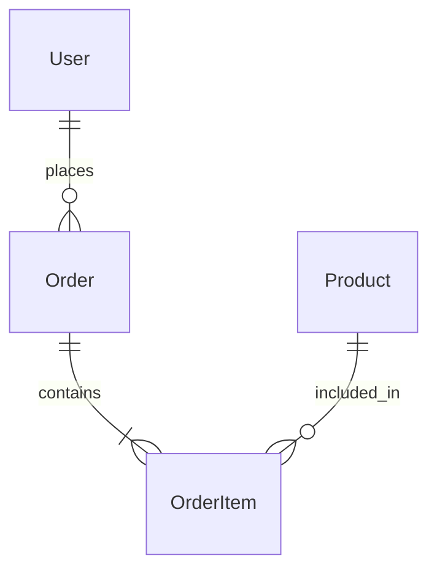

# Service Planner

서비스를 설계하고 **구체적인 기능 요구사항(FR-xxx)**을 도출합니다.
"무엇을 어떻게 만들 것인가?"에 답하며, PRD가 이 산출물을 그대로 수용할 수 있는 수준의 구체성을 목표로 합니다.

<HARD-GATE>
기능 요구사항 테이블(Step 5)이 사용자 승인 없이 PRD로 전달되어서는 안 됩니다.
반드시 사용자 확인 후 저장합니다.
</HARD-GATE>

## 워크플로우

### Step 1: 입력 판별 및 범위 결정

| 입력 상황 | 실행 Step |
|----------|----------|
| P0-C 사업 기획서와 함께 호출 (planning-agent 경유) | Step 2 → Step 3 → Step 4 → Step 5 → Step 6 |
| 사용자가 직접 호출 (사업 기획 없음) | Step 3 → Step 4 → Step 5 → Step 6 |
| 기존 서비스 기획 수정 요청 | Step 3(기존 로드) → Step 5(수정) → Step 6 |

기존 서비스 기획 확인: `dev/docs/service/` 탐색.

### Step 2: 사업 기획 통합

`dev/docs/business/business-plan-<name>.md`에서 핵심 결정을 추출합니다.

**추출 대상 (P0-D 연결 섹션 우선 참조):**
- 타겟 고객 세그먼트 → Step 3 페르소나의 기반
- 핵심 가치 제안 (UVP) → Step 3 시나리오의 방향
- 수익 모델 → Step 5 기능 범위의 제약 (유료 기능 vs 무료 기능)
- 핵심 KPI → Step 5 비기능 요구사항의 기준
- 제약 조건 → Step 4-5 전체에 적용

추출 결과를 요약하여 사용자에게 보여주고 확인합니다.

### Step 3: 사용자 여정 설계 (User Journey Mapping)

#### 3-1. 핵심 페르소나 정의

사업 기획의 Customer 정보 (있으면)를 기반으로 페르소나를 구체화합니다.

```
타겟 사용자를 구체적으로 정의하겠습니다.

주요 사용자의 역할/직업, 핵심 니즈, 현재 겪는 불편함(Pain Point)을 알려주세요.
```

| 항목 | 내용 |
|------|------|
| 이름/역할 | [가상 인물명, 직업] |
| 핵심 니즈 | [이 서비스에서 원하는 것] |
| Pain Point | [현재 겪는 불편함] |
| 현재 대안 | [지금 사용 중인 해결책] |
| 성공 기준 | [서비스 사용 후 달라지는 것] |

#### 3-2. 주요 사용자 시나리오 도출

페르소나를 기반으로 **3~5개 핵심 시나리오**를 도출합니다.
시나리오 하나씩 순차적으로 사용자에게 확인합니다.

```
시나리오 1: [시나리오명]

상황: [사용자가 처한 상황]
목표: [사용자가 달성하려는 것]
과정: [서비스를 통해 해결하는 단계]
결과: [달성한 상태]

이 시나리오가 맞나요? 수정/추가할 부분이 있으면 말씀해주세요.
```

#### 3-3. User Story 작성

각 시나리오를 User Story 형식으로 변환합니다.
`resources/service-frameworks.md`의 User Story 가이드를 참조합니다.

형식: `[역할]로서, [목표]하기 위해, [기능]하고 싶다.`

예시:
- "구매자로서, 원하는 상품을 빠르게 찾기 위해, 카테고리 필터링을 하고 싶다."
- "판매자로서, 매출을 추적하기 위해, 대시보드에서 일별 매출 차트를 보고 싶다."

### Step 4: 정보 아키텍처 (IA) 설계

User Story를 기반으로 서비스의 전체 구조를 설계합니다.

#### 4-1. 화면 계층 구조 (Site Map)

```
[서비스명]
├── 인증
│   ├── 로그인
│   ├── 회원가입
│   └── 비밀번호 찾기
├── 메인
│   ├── 대시보드
│   └── [핵심 기능 영역]
├── [기능 영역 2]
│   ├── [하위 화면]
│   └── [하위 화면]
├── 설정
│   ├── 프로필
│   └── 알림 설정
└── 관리자 (해당 시)
    └── [관리 화면]
```

#### 4-2. 핵심 화면 목록

| 화면 | 역할 | 주요 기능 | 관련 User Story |
|------|------|----------|----------------|
| [화면명] | [역할] | [기능 목록] | US-001, US-002 |

#### 4-3. 화면 간 네비게이션 플로우

핵심 사용자 흐름을 Mermaid flowchart로 시각화합니다.


#### 4-4. 데이터 모델 초안

핵심 Entity와 관계를 정의합니다.



| Entity | 핵심 필드 | 관계 |
|--------|----------|------|
| [Entity명] | [필드 목록] | [관계 설명] |

사용자에게 IA 전체를 보여주고 확인합니다.

### Step 5: 기능 요구사항 도출 — 핵심 산출물

이 Step이 전체 P0 파이프라인의 **가장 중요한 결과물**입니다.

#### 5-1. User Story → Epic → Feature → Requirement 분해

`resources/service-frameworks.md`의 분해 가이드를 참조합니다.

**분해 과정:**
```
User Story: "구매자로서, 원하는 상품을 빠르게 찾기 위해, 검색 기능을 사용하고 싶다."
  ↓
Epic: 상품 검색
  ↓
Feature: 키워드 검색, 카테고리 필터, 가격 정렬
  ↓
Requirement:
  - FR-001: 검색창에 키워드 입력 시 상품명/설명에서 검색
  - FR-002: 카테고리 다중 선택 필터링
  - FR-003: 가격 오름차순/내림차순 정렬
```

#### 5-2. 기능 요구사항 테이블 (FR-xxx)

각 Requirement를 **MoSCoW 우선순위**로 분류하고 **수용 기준**을 명시합니다.
`resources/service-frameworks.md`의 MoSCoW 가이드와 Acceptance Criteria 가이드를 참조합니다.

| ID | Epic | Feature | Requirement | 우선순위 | 수용 기준 |
|----|------|---------|-------------|---------|----------|
| FR-001 | [Epic명] | [Feature명] | [구체적 요구사항] | Must/Should/Could/Won't | [Given-When-Then 또는 체크리스트] |

**수용 기준 작성법** (Given-When-Then):
```
Given: [사전 조건]
When: [사용자 행동]
Then: [예상 결과]
```

또는 체크리스트 형식:
```
- [ ] [검증 항목 1]
- [ ] [검증 항목 2]
```

#### 5-3. 비기능 요구사항 테이블 (NFR-xxx)

`resources/service-frameworks.md`의 비기능 요구사항 체크리스트를 참조합니다.

| ID | 카테고리 | 요구사항 | 기준 | 측정 방법 |
|----|---------|---------|------|----------|
| NFR-001 | 성능 | [요구사항] | [수치 기준] | [측정 도구/방법] |
| NFR-002 | 보안 | [요구사항] | [기준] | [검증 방법] |
| NFR-003 | 접근성 | [요구사항] | [WCAG 수준] | [검사 도구] |

#### 5-4. 사용자 확인

기능 요구사항 테이블을 사용자에게 보여주고 확인합니다:

```
기능 요구사항이 도출되었습니다.

## 요약
- Must 기능: [N]개
- Should 기능: [N]개
- Could 기능: [N]개
- 비기능 요구사항: [N]개

## 전체 기능 요구사항 테이블
[테이블 표시]

수정/추가/삭제할 항목이 있으면 말씀해주세요.
확정되면 서비스 기획서에 저장합니다.
```

### Step 6: 서비스 기획서 저장 및 PRD 연결

**저장:**
- 저장 경로: `dev/docs/service/service-plan-<name>.md`
- 파일명 규칙: kebab-case (예: `service-plan-deal-platform.md`)

**문서 구조** (`resources/service-frameworks.md`의 출력 템플릿 참조):
```markdown
# 서비스 기획서: [서비스명]

**작성일**: [YYYY.MM.DD]
**상태**: Draft
**사업 기획 참조**: [dev/docs/business/xxx.md] (해당 시)

## 1. 핵심 페르소나
[Step 3-1 결과]

## 2. 사용자 시나리오
[Step 3-2 결과]

## 3. User Stories
[Step 3-3 결과]

## 4. 정보 아키텍처
### 4.1 화면 계층 구조
[Step 4-1 결과]
### 4.2 핵심 화면 목록
[Step 4-2 결과]
### 4.3 네비게이션 플로우
[Step 4-3 결과]
### 4.4 데이터 모델 초안
[Step 4-4 결과]

## 5. 기능 요구사항 (FR)
[Step 5-2 테이블]

## 6. 비기능 요구사항 (NFR)
[Step 5-3 테이블]

## P1 연결: PRD 생성을 위한 핵심 데이터
- **서비스명**: [서비스명]
- **핵심 기능 (Must)**: [Must 기능 요약 목록]
- **타겟 사용자**: [페르소나 1줄 요약]
- **핵심 화면 수**: [N]개
- **데이터 모델**: [핵심 Entity 목록]
```

**사용자 확인:**
```
서비스 기획서가 생성되었습니다.

파일 위치: dev/docs/service/service-plan-<name>.md

## 핵심 요약
- 페르소나: [주요 사용자]
- 시나리오: [N]개
- 기능 요구사항: Must [N]개 / Should [N]개 / Could [N]개
- 비기능 요구사항: [N]개
- 핵심 화면: [N]개

PRD를 생성하려면: "PRD 생성해줘" 또는 /prd-generator
(service-plan이 자동으로 참조됩니다)
```

## 참조 문서

- 서비스 기획 프레임워크: `resources/service-frameworks.md`
- 서비스 기획서 저장소: `dev/docs/service/`
- 사업 기획서 저장소: `dev/docs/business/`

## 프로젝트 커스텀 리소스

> 아래 경로에 `.md` 파일이 존재하면 서비스 기획 시 자동으로 참조됩니다. 파일이 없으면 이 섹션은 무시됩니다.

| 카테고리 | 경로 | 이 스킬에서의 용도 |
|---------|------|-------------------|
| 도메인 지식 | `.claude/resources/domain-knowledge/` | FR/NFR 도출 시 비즈니스 규칙, 도메인 제약 조건 반영 |
